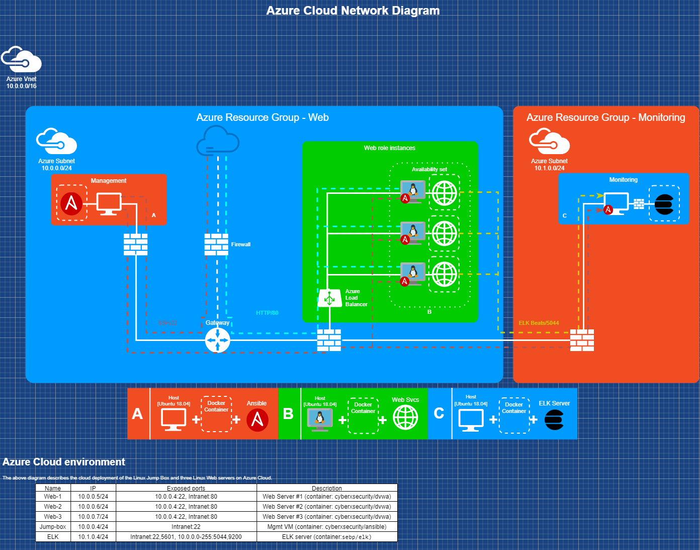

## Automated ELK Stack Deployment

This document contains the following details:
- Description of the Topology
- Access Policies
- ELK Configuration
  - Beats in Use
  - Machines Being Monitored
- How to Use the Ansible Build


### Description of the Topology

The files in this repository were used to configure the network depicted below.



The main purpose of this network is to expose a load-balanced and monitored instance of DVWA, the Damn Vulnerable Web Application.

Load balancing ensures that the application will be highly available, in addition to restricting public access to the web servers.

Integrating an ELK server allows users to easily monitor the vulnerable VMs for changes to the system files and system metrics.

The configuration details of each machine may be found below.

| Name     | Function | IP Address | Operating System |
|:----------|:----------|:------------|:------------------|
| Jump Box  | Gateway         | 10.0.0.4   | Linux            |
| Web-1     | DVWA web server | 10.0.0.5   | Linux            |
| Web-2     | DVWA web server | 10.0.0.6   | Linux            |
| Web-3     | DVWA web server | 10.0.0.7   | Linux            |
| ELK Server | Monitoring server | 10.1.0.4 | Linux           |

### Access Policies

The machines on the internal network are not exposed to the public Internet. 

Only the jump box and ELK server can accept connections from the Internet. Access to these machines is only allowed from the following IP addresses:
- 52.177.85.216 

Machines within the network can only be accessed by internal hosts.
- 10.0.0.0/24 or 10.1.0.0/24

A summary of the access policies in place can be found in the table below.

| Name     | Publicly Accessible | Allowed IP Addresses |
|:---------|:--------------------|:---------------------|
| Jump Box | Yes                 | 52.177.85.216        |
| DVWA servers  | No             | 10.0.0.1-255         |
| Load Balancer | Yes            | 52.177.85.216        |
| ELK      | No                  | 10.0.0.4             |
| ELK (Web UI)  | Yes            | 52.177.85.216        |  


### Elk Configuration

Ansible was used to automate configuration of the ELK machine. No configuration was performed manually, which is advantageous because...
- The process is consistent and repeatable

The playbook implements the following tasks:
- Install Docker and any dependencies
- Modify the OS configuration to suit the installation
- Download the container
- Make the installation persistent through restarts
  
The following screenshot displays the result of running `docker ps` after successfully configuring the ELK instance.


These files have been tested and used to generate a live ELK deployment on Azure. They can be used to recreate the entire deployment pictured above. Alternatively, select portions of the playbook file may be used to install only certain pieces of it, such as Filebeat.

```yaml
---
  - name: Install docker and elk
    hosts: elk
    become: true
    tasks:

      - name: Uninstall apache2
        apt:
          force_apt_get: yes
          update_cache: yes
          name: apache2
          state: absent

      - name: Install docker.io
        apt:
          force_apt_get: yes
          name: docker.io
          state: present

      - name: Install pip3
        apt:
          force_apt_get: yes
          name: python3-pip
          state: present

      - name: Install Docker python module
        pip:
          name: docker
          state: present

      - name: Set Ansible Sysctl - vm.max_map_count for memory use
        ansible.posix.sysctl:
          name: vm.max_map_count
          value: '262144'
          state: present

      - name: Install docker elk container sebp/elk:761
        docker_container:
          name: elk
          image: sebp/elk:761
          state: started
          restart_policy: always
          ports:
           - "5601:5601"
           - "9200:9200"
           - "5044:5044"

      - name: Enable docker service
        systemd:
          name: docker
          enabled: yes
```


### Target Machines & Beats
This ELK server is configured to monitor the following machines:
- _TODO: List the IP addresses of the machines you are monitoring_

We have installed the following Beats on these machines:
- _TODO: Specify which Beats you successfully installed_

These Beats allow us to collect the following information from each machine:
- _TODO: In 1-2 sentences, explain what kind of data each beat collects, and provide 1 example of what you expect to see. E.g., `Winlogbeat` collects Windows logs, which we use to track user logon events, etc._

### Using the Playbook
In order to use the playbook, you will need to have an Ansible control node already configured. Assuming you have such a control node provisioned: 

SSH into the control node and follow the steps below:
- Copy the _____ file to _____.
- Update the _____ file to include...
- Run the playbook, and navigate to ____ to check that the installation worked as expected.

_TODO: Answer the following questions to fill in the blanks:_
- _Which file is the playbook? Where do you copy it?_
- _Which file do you update to make Ansible run the playbook on a specific machine? How do I specify which machine to install the ELK server on versus which to install Filebeat on?_
- _Which URL do you navigate to in order to check that the ELK server is running?

_As a **Bonus**, provide the specific commands the user will need to run to download the playbook, update the files, etc._

